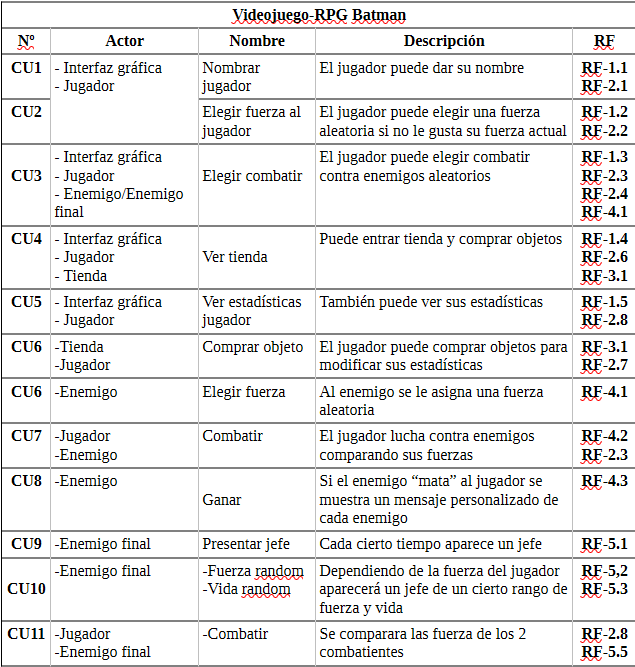
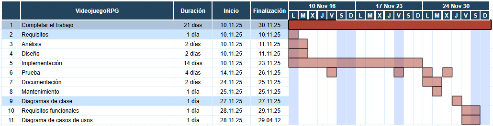

# ClaseVideojuegoRPG

Nuestro videojuego es un RPG que abarca la historia de una persona comun que ayuda a batmab por una noche a combatir enemigos.

## Requisitos funcionales

**RF-1: Responsable interfaz grafica**
- **RF-1.1** Nombrar jugador
- **RF-1.2** Elegir fuerza
- **RF-1.3** Elegir combatir
- **RF-1.4** Tienda
- **RF-1.5** Ver estadisticas jugador

**RF-2: Responsable Jugador**
- **RF-2.1** Nombrar jugador
- **RF-2.2** Elegir fuerza
- **RF-2.3** Combatir contra enemigo, ganar, perder, morir
- **RF-2.4** Combatir contra enemigo final
- **RF-2.6** Tienda
- **RF-2.7** Comprar tienda
- **RF-2.8** ver estadistcas del jugador
  
**RF-3: Responsable Tienda**
- **RF-3.1** Abrir Tienda
- **RF-3.2** Comprar objeto(Curas, Armamento)

**RF-4: Responsble Enemigo**
- **RF-4.1** Asignar la furza aleatoria
- **RF-4.2** Combatir
- **RF-4.3** Ganar

**RF-5: Responable enemigo final**
- **RF-5.1** Presentacion del enemigo
- **RF-5.2** Anignar la fuerza aleatoria
- **RF-5.3** Anignar la vida aleatoria
- **RF-5.4** Ver las estadisticas del enemigo final
- **RF-5.5** Combatir contra enemigo, ganar, perder, morir

## Casos de uso

## Diagrama de gantt

